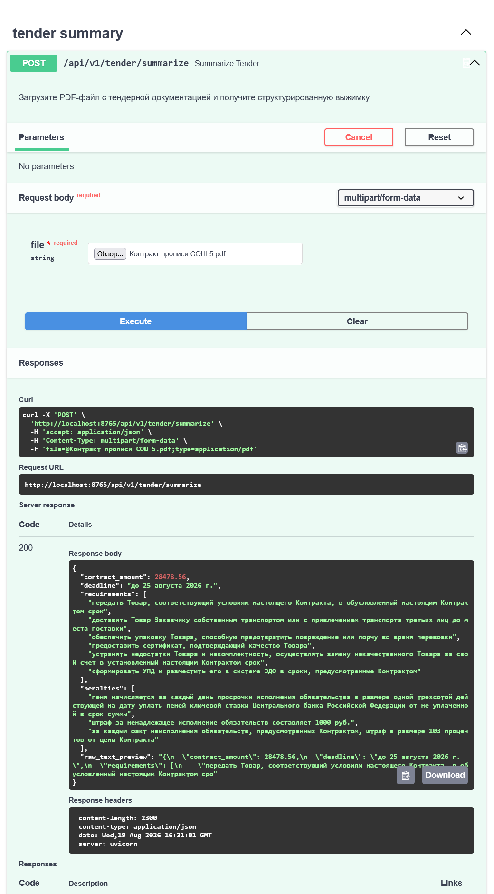

# tender-summarizer

Self-hosted AI суммаризатор тендерной документации. Сервис принимает PDF-файл с тендерной документацией, извлекает из него текст и с помощью языковой модели (OpenAI-совместимого API) формирует структурированную выжимку.

## Логика решения

Сервис построен на [FastAPI](https://fastapi.tiangolo.com/) и состоит из трёх логических блоков:

1. HTTP-слой (`src/apps/tender/routes.py`)
   - Эндпоинт `POST /api/v1/tender/summarize` принимает PDF-файл через `multipart/form-data`.
   - Валидирует запрос, вызывает сервисы и преобразует ошибки в HTTP-ответы.
   - Ошибки: `400` — некорректный PDF, `503` — проблемы с LLM, `500` — внутренняя ошибка.

2. Извлечение текста (`src/apps/tender/services/pdf_parser.py`)
   - Класс `PDFParser` проверяет размер файла (лимит 5 MB по умолчанию).
   - Проверяет, что файл действительно PDF (сигнатура `%PDF`).
   - С помощью `pdfplumber` извлекает текст построчно со всех страниц.
   - Отсканированные PDF без текстового слоя приводят к ошибке.

3. Работа с LLM (`src/apps/tender/services/llm_service.py`)
   - Класс `LLMService` оборачивает `AsyncOpenAI`.
   - Строит промпт, требующий от модели ответ строго в формате JSON.
   - Длинный текст обрезается до `max_text_length` (100 000 символов по умолчанию).
   - Выполняет запрос с экспоненциальной задержкой и джиттером при сбоях (rate limit, таймауты, ошибки соединения), до `openai_max_retries` попыток.
   - Разбирает ответ модели в модель `TenderSummaryResponse`.

Результат суммирования (`src/apps/tender/schemas.py`):

- `contract_amount` — сумма контракта в рублях (число или `null`).
- `deadline` — срок выполнения (строка или `null`).
- `requirements` — ключевые требования к исполнителю (массив строк).
- `penalties` — штрафные санкции (массив строк).
- `raw_text_preview` — превью исходного текста (первые 200 символов ответа модели).

## Настройка

1. Убедитесь, что установлен [Python](https://www.python.org/) версии 3.14 или выше и [Poetry](https://python-poetry.org/).

2. Установите зависимости:

   ```bash
   poetry install
   ```

3. Создайте файл `.env` в корне проекта на основе настроек из `src/core/config.py`:

   ```dotenv
   # Обязательно
   OPENAI_API_KEY=your-api-key

   # Опционально
   OPENAI_API_BASE_URL=https://api.openai.com/v1
   OPENAI_MODEL=gpt-4o
   DEBUG=false
   LOG_LEVEL=INFO
   SERVER_HOST=localhost
   SERVER_PORT=8765
   ```

   `OPENAI_API_KEY` обязателен. Для использования кастомных (OpenAI-совместимых) провайдеров укажите `OPENAI_API_BASE_URL` и `OPENAI_MODEL`.

## Запуск

Из корня проекта:

```bash
poetry run app
```

Либо напрямую через `uvicorn`:

```bash
poetry run uvicorn main:app --reload
```

Сервис запустится по адресу `http://localhost:8765`. Интерактивная документация доступна на `http://localhost:8765/docs`.

## Пример запроса

```bash
curl -X POST http://localhost:8765/api/v1/tender/summarize \
  -F "file=@path/to/tender.pdf"
```

Пример ответа:

```json
{
  "contract_amount": 1500000.0,
  "deadline": "30 дней с даты подписания контракта",
  "requirements": ["лицензия на строительство", "опыт работы от 3 лет"],
  "penalties": ["штраф 0,5% за каждый день просрочки"],
  "raw_text_preview": "..."
}
```

## Структура проекта

```
main.py                       # Точка входа приложения
src/
  apps/
    tender/
      routes.py               # Эндпоинт summarize
      schemas.py              # Pydantic-модели ответа
      services/
        pdf_parser.py         # Извлечение текста из PDF
        llm_service.py        # Обращение к LLM и парсинг ответа
  core/
    config.py                 # Настройки из переменных окружения
    exceptions.py             # Кастомные исключения
tests/                        # Тесты
```

## Разработка

Для проверки кода используется [ruff](https://docs.astral.sh/ruff/):

```bash
poetry run ruff check .
poetry run ruff format .
```

Перед коммитами настроен `pre-commit` (см. `.pre-commit-config.yaml`).\
Пример запроса в сваггере:

